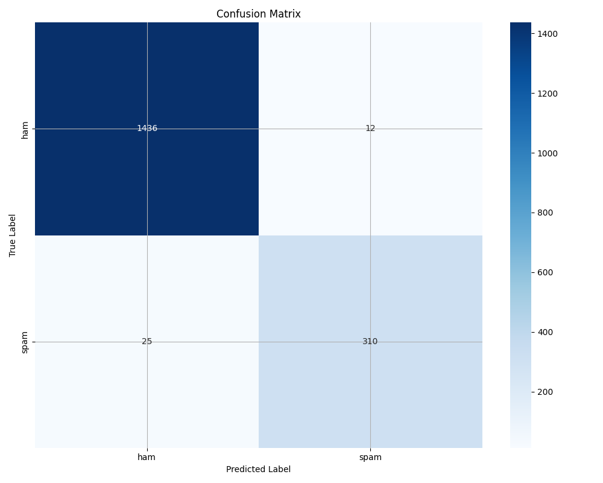

# 📧 Spam Message Classifier using Machine Learning (TF-IDF + Logistic Regression)

This project is a simple yet effective spam message classification system using classical machine learning techniques. It uses TF-IDF vectorization and a logistic regression model to identify whether a message is **spam** or **safe (ham)**.

---

## 🔧 Features

- **TF-IDF Vectorization** for text preprocessing  
- **Logistic Regression** for classification  
- **SMOTE** for balancing the dataset  
- **Confusion Matrix** for model evaluation  
- **Interactive CLI-based Predictor**  
- Ready for extending with other models like RandomForest, XGBoost, or Neural Networks

---

## 📊 Confusion Matrix

This image is automatically generated after training:



---

## 🗂️ Project Structure

| File / Folder              | Description                                                                 |
|---------------------------|-----------------------------------------------------------------------------|
| `Train_Model.py`          | Trains the spam detection model and saves it to disk                       |
| `Read_And_Predict.py`     | Loads the trained model and predicts whether user input is spam or not     |
| `data/SMSSpamCollection`  | Raw SMS dataset (tab-separated, with labels)                                |
| `Model/Spam_Safe.pkl`     | Saved machine learning model (Logistic Regression)                         |
| `Model/vectorizer.pkl`    | Saved TF-IDF vectorizer for transforming user input                         |
| `Confusion_Matrix.png`    | Output image of confusion matrix after training                             |
| `requirements.txt`        | All required packages with exact versions                                   |

---

## 📦 Requirements

Install all dependencies using:

```bash
pip install -r requirements.txt


--- 


## 🚀 How to Train the Model
Run the training script:
```bash
python Train_Model.py

Loads and cleans the dataset (SMSSpamCollection)

Balances it using SMOTE

Trains a logistic regression model

Saves the model and vectorizer to the Model/ directory

Generates and saves a confusion matrix plot as Confusion_Matrix.png


🔮 How to Predict
Run the prediction script:

```bash
python Read_And_Predict.py

Enter Text To check: "Congratulations! You've won a prize!"
Predicted Model: ((Congratulations Youve won a prize)) is = Spam


